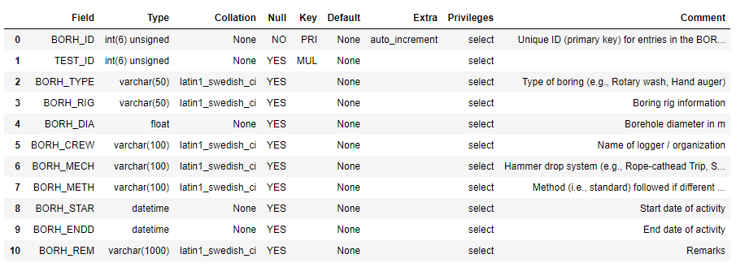

# Example Queries

This document demonstrates how to query the NGL database using DesignSafe. The queries begin simple and become progressively more complicated. Screenshots of output from the queries indicate the status of the database at the time the figure was generated, and will therefore not necessarily match the results of queries performed on the database in its current state.

## Jupyter Notebook
[Jupyter Notebook in DesignSafe](https://jupyter.designsafe-ci.org/user/name/tree/CommunityData/NGL/ExampleQueries.ipynb)

## Query site table using pandas

An easy way to query the database is to use the Pandas read_sql command, which queries data and returns a Pandas dataframe. 
The commands below imports the Pandas and ngl_db packages, creates a connection object to ngl_db called cnx, creates a 
string called sql that queries all information from the SITE table, and creates a Pandas dataframe called df that contains 
the results of the query.

```python
import designsafe_db.ngl_db as ngl
sql = "SELECT * FROM SITE"
df = ngl.read_sql(sql)
df
```

The output from the command is illustrated in the figure below. When this query was written, there were a total of 333 sites in 
the NGL database. The SITE_ID field is not contiguous because sites are sometimes deleted from the database, and the 
SITE_ID field is never re-used. The Pandas dataframe is broken between SITE_ID 151 and 677 for ease of displaying 
information in the output window. Many rows of data are not displayed in Figure 2 as a result.


  
  **Figure 2.** Results of query of SITE table data.

## Query Wildlife liquefaction array data

This cell queries event information from the EVNT table and surface evidence of liquefaction information from the FLDM table at the Wildlife Array site. The definition of each table and site is below. The query utilizes an INNER JOIN statement to combine tables based on shared keys, and will return all values that have matching keys in both tables. For more details, see <https://www.w3schools.com/sql/sql_join_inner.asp>

**Table 1.** List of tables utilized in Wildlife liquefaction array queries.

| Table	| Description |
| ----- | ----------- |
| EVNT	| 	Earthquake event information |
| FLDM	| 	Field evidence of liquefaction information at a point within a site |
| FLDO	| 	Field evidence of liquefaction information at a site |
| SITE	| 	A site is the highest level organizational structure for information in the database |

**Table 2.** List of fields utilized in Wildlife liquefaction array queries.

| Field	| Description |
| ----- | ----------- |
| EVNT_MAG | 	Earthquake magnitude |
| EVNT_NM | 	  Event name |
| EVNT_YR | 	  Event year |
| FLDM_LAT | 	Latitude of manifestation observation |
| FLDM_LON | 	Longitude of manifestation observation |
| FLDM_SFEV | 	Indication of whether surface manifestation occurred (0 = no, 1 = yes) |
| FLDM_DESC | 	Description of liquefaction manifestation |
| FLDO_ID |    Primary key in FLDO table, and foreign key in FLDM table |
| EVNT_ID |    Primary key in EVNT table, and foreign key in FLDO table |
| SITE_ID |    Primary key in SITE table, and foreign key in FLDO table |
| SITE_NAME |  Site name |

```python
import designsafe_db.ngl_db as ngl

sql = 'SELECT EVNT.EVNT_MAG, EVNT.EVNT_NM, EVNT.EVNT_YR, FLDM.FLDM_LAT, FLDM.FLDM_LON, FLDM.FLDM_SFEV, FLDM.FLDM_DESC '
sql += 'FROM FLDO INNER JOIN FLDM on FLDO.FLDO_ID = FLDM.FLDO_ID '
sql += 'INNER JOIN EVNT ON EVNT.EVNT_ID = FLDO.EVNT_ID '
sql += 'INNER JOIN SITE ON FLDO.SITE_ID = SITE.SITE_ID '
sql += 'WHERE SITE_NAME = "Wildlife Array"'

df = ngl.read_sql(sql)
pd.set_option('display.max_colwidth', 100)
df
```


  

**Figure 3.** Screenshot of result of query of Wildlife liquefaction array query of event information and field observations.

## Query Wildlife liquefaction CPT data

This query retrieves all cone penetration test data from the Wildlife liquefaction array. INNER JOIN statements are needed to link SCPT to SCPG (using SCPG_ID), SCPG to TEST (using TEST_ID), and TEST to SITE (using SITE_ID). This query demonstrates propagation of primary and foreign keys through the schema heirarchy.

```python  
import pandas as pd
import designsafe_db.ngl_db as ngl

command = 'SELECT TEST.TEST_ID, TEST.TEST_NAME, SCPT. SCPT_DPTH, SCPT.SCPT_RES, SCPT.SCPT_FRES FROM SCPT '
command += 'INNER JOIN SCPG ON SCPT.SCPG_ID = SCPG.SCPG_ID '
command += 'INNER JOIN TEST ON TEST.TEST_ID = SCPG.TEST_ID '
command += 'INNER JOIN SITE ON SITE.SITE_ID = TEST.SITE_ID '
command += 'WHERE SITE.SITE_NAME = "Wildlife Array"'

df = ngl.read_sql(command)
pd.set_option('display.max_rows', 10)
df
```


**Figure 4.** Screenshot of result of query of Wildlife liquefaction array query of cone penetration test data.

## Query number of data entries in various tables

This query demonstrates the MySQL COUNT function to return the number of cone penetration tests, boreholes, surface wave measurements, invasive shear wave velocity measurement, liquefaction observations, and non-liquefaction observations. Rather than querying directly to a Pandas dataframe, in this case we use the pymysql package to query the data, and subsequently assemble the count data into a Pandas dataframe for viewing.

```python
import designsafe_db.ngl_db as ngl
import pandas as pd

command = 'SELECT (SELECT COUNT(SCPG_ID) FROM SCPG) as "CPT Soundings", '
command += '(SELECT COUNT(BORH_ID) FROM BORH) as "Boreholes", '
command += '(SELECT COUNT(GSWG_ID) FROM GSWG) as "Surface Wave Measurements", '
command += '(SELECT COUNT(GINV_ID) FROM GINV) as "Invasive VS Measurements", '
command += '(SELECT COUNT(FLDM_ID) FROM FLDM WHERE FLDM_SFEV=1) as "Liquefaction Observations", '
command += '(SELECT COUNT(FLDM_ID) FROM FLDM WHERE FLDM_SFEV=0) as "Non-Liquefaction Observations"'

count = ngl.read_sql(command).T
count.columns=["Count"]
count
```


**Figure 5.** Screenshot of counts of data quantities in various tables.

## Query list of table names

The cell below queries the names of all of the tables in the NGL database into a Pandas dataframe. By default, Pandas truncates dataframes for compact viewing. The cell below illustrates how to use the "set_option" command to set the number of rows to a custom value, in this case the length of the Pandas dataframe.

```python
import pandas as pd
import designsafe_db.ngl_db as ngl

sql = 'show tables'
table_names = ngl.read_sql(sql)
pd.set_option('display.max_rows', len(table_names))
table_names
```


**Figure 6.** Screenshot of list of tables in NGL database.
    
## Query schema for BORH table

The BORH table is the first in the alphebetical list of tables. A description of the headings returned by the DESCRIBE command is in the table below.

**Table 3.** List of headings describing fields in table returned by SQL DESCRIBE command.

| Column  |  Description |
| ------  |  ----------- |
| Field  |     Name of table entry |
| Type |       Datatype of entry |
| Null  |      YES = null fields are allowed, NO = null fields are not allowed |
| Key   |      PRI = Primary key, MUL = Foreign key |
| Default  |   Default value |
| Extra   |    auto_increment = value is automatically assigned incrementally |

The cell below uses the SHOW FULL COLUMNS command to display the fields in the BORH table. This includes a "Comment" that defines each field.

```python
import pandas as pd
import designsafe_db.ngl_db as ngl

sql = 'SHOW FULL COLUMNS FROM BORH'
bohr_desc = ngl.read_sql(sql)
pd.set_option('display.max_rows', len(bohr_desc))
bohr_desc
```



**Figure 7.** Screenshot of fields contained in BORH table. 
