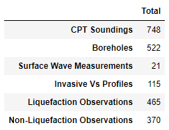
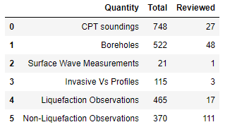

===============
Example Queries
===============

This document demonstrates how to query the NGL database using DesignSafe. The queries begin simple and become progressively more complicated.

----------------
Jupyter Notebook
----------------
`Jupyter Notebook in DesignSafe <https://jupyter.designsafe-ci.org/user/name/tree/CommunityData/NGL/ExampleQueries.ipynb>`_

-----------------------------
Query site table using pandas
-----------------------------

An easy way to query the database is to use the Pandas read_sql command, which queries data and returns a Pandas dataframe. 
The commands below imports the Pandas and ngl_db packages, creates a connection object to ngl_db called cnx, creates a 
string called sql that queries all information from the SITE table, and creates a Pandas dataframe called df that contains 
the results of the query.

.. code-block:: python

  import pandas as pd
  import ngl_db

  cnx = ngl_db.connect()
  sql = "SELECT * FROM SITE"
  df = pd.read_sql(sql,cnx)
  df

The output from the command is illustrated in the figure below. When this query was written, there were a total of 333 sites in 
the NGL database. The SITE_ID field is not contiguous because sites are sometimes deleted from the database, and the 
SITE_ID field is never re-used. The Pandas dataframe is broken between SITE_ID 151 and 677 for ease of displaying 
information in the output window. Many rows of data are not displayed in Figure 2 as a result.

.. figure:: images/SiteTableQuery.png
  :alt: Screenshot of result of query of SITE table data.
  
  **Figure 2.** Results of query of SITE table data.

--------------------------------------
Query Wildlife liquefaction array data
--------------------------------------

This cell queries event information from the EVNT table and surface evidence of liquefaction information from the FLDM table at the Wildlife Array site. The definition of each table and site is below. The query utilizes an INNER JOIN statement to combine tables based on shared keys, and will return all values that have matching keys in both tables. For more details, see `https://www.w3schools.com/sql/sql_join_inner.asp <https://www.w3schools.com/sql/sql_join_inner.asp>`_  

===== ===========
Table	Description
===== ===========
EVNT	Earthquake event information
FLDM	Field evidence of liquefaction information at a point within a site
FLDO	Field evidence of liquefaction information at a site
SITE	A site is the highest level organizational structure for information in the database
===== ===========

========= ===========
Field	    Description
========= ===========
EVNT_MAG	Earthquake Magnitude
EVNT_NM	  Event Name
EVNT_YR	  Event Year
FLDM_LAT	Latitude of manifestation observation
FLDM_LON	Longitude of manifestation observation
FLDM_SFEV	Indication of whether surface manifestation occurred (0 = no, 1 = yes)
FLDM_DESC	Description of liquefaction manifestation
========= ===========

.. code-block:: python
  
  import pandas as pd
  import ngl_db

  cnx = ngl_db.connect()

  sql = 'SELECT EVNT.EVNT_MAG, EVNT.EVNT_NM, EVNT.EVNT_YR, FLDM.FLDM_LAT, FLDM.FLDM_LON, FLDM.FLDM_SFEV, FLDM.FLDM_DESC '
  sql += 'FROM FLDO INNER JOIN FLDM on FLDO.FLDO_ID = FLDM.FLDO_ID '
  sql += 'INNER JOIN EVNT ON EVNT.EVNT_ID = FLDO.EVNT_ID '
  sql += 'INNER JOIN SITE ON FLDO.SITE_ID = SITE.SITE_ID '
  sql += 'WHERE SITE_NAME = "Wildlife Array"'

  df = pd.read_sql_query(sql, cnx)
  pd.set_option('display.max_colwidth', 100)
  df

.. figure:: images/WildlifeQuery1.png
  :alt: Screenshot of result of query of Wildlife liquefaction array query of event information and field observations.
  
  **Figure 3.** Screenshot of result of query of Wildlife liquefaction array query of event information and field observations.

--------------------------------------
Query Wildlife liquefaction CPT data
--------------------------------------

This query retrieves all cone penetration test data from the Wildlife liquefaction array. INNER JOIN statements are needed to link SCPT to SCPG (using SCPG_ID), SCPG to TEST (using TEST_ID), and TEST to SITE (using SITE_ID). This query demonstrates propagation of primary and foreign keys through the schema heirarchy.

.. code-block:: python
  
  import pandas as pd
  import ngl_db

  cnx = ngl_db.connect()
  
  command = 'SELECT TEST.TEST_ID, TEST.TEST_NAME, SCPT. SCPT_DPTH, SCPT.SCPT_RES, SCPT.SCPT_FRES FROM SCPT '
  command += 'INNER JOIN SCPG ON SCPT.SCPG_ID = SCPG.SCPG_ID '
  command += 'INNER JOIN TEST ON TEST.TEST_ID = SCPG.TEST_ID '
  command += 'INNER JOIN SITE ON SITE.SITE_ID = TEST.SITE_ID '
  command += 'WHERE SITE.SITE_NAME = "Wildlife Array"'
  
  df = pd.read_sql_query(command, cnx)
  pd.set_option('display.max_rows', 10)
  df
  
.. figure:: images/WildlifeQuery2.png
   :alt: Screenshot of result of query of Wildlife liquefaction array query of cone penetration test data.

    **Figure 4.** Screenshot of result of query of Wildlife liquefaction array query of cone penetration test data.

----------------------------------------------
Query number of data entries in various tables
----------------------------------------------

This query demonstrates the MySQL COUNT function to return the number of cone penetration tests, boreholes, surface wave measurements, invasive shear wave velocity measurement, liquefaction observations, and non-liquefaction observations. Rather than querying directly to a Pandas dataframe, in this case we use the pymysql package to query the data, and subsequently assemble the count data into a Pandas dataframe for viewing.

.. code-block:: python

  import pymysql
  import pandas as pd
  import ngl_db

  cnx = ngl_db.connect()
  cursor = cnx.cursor()
  command = 'SELECT COUNT(SCPG_ID) FROM SCPG'
  cursor.execute(command)
  count_cpt = cursor.fetchone()[0]
  command = 'SELECT COUNT(FLDM_ID) FROM FLDM WHERE FLDM_SFEV=1'
  cursor.execute(command)
  count_fldo_yes = cursor.fetchone()[0]
  command = 'SELECT COUNT(FLDM_ID) FROM FLDM WHERE FLDM_SFEV=0'
  cursor.execute(command)
  count_fldo_no = cursor.fetchone()[0]
  command = 'SELECT COUNT(BORH_ID) FROM BORH'
  cursor.execute(command)
  count_borehole = cursor.fetchone()[0]
  command = 'SELECT COUNT(GSWG_ID) FROM GSWG'
  cursor.execute(command)
  count_swave = cursor.fetchone()[0]
  command = 'SELECT COUNT(GINV_ID) FROM GINV'
  cursor.execute(command)
  count_vs = cursor.fetchone()[0]
  df = pd.DataFrame(data = [count_cpt, count_borehole, count_swave, count_vs, count_fldo_yes, count_fldo_no], index=['CPT Soundings','Boreholes','Surface Wave Measurements','Invasive Vs Profiles','Liquefaction Observations','Non-Liquefaction Observations'], columns=['Total'])
  pd.set_option('display.max_rows', 10)
  df

  
  **Figure 5.** Screenshot of counts of data quantities in various tables.
  
-------------------------------------------------------------------------------------
Query number of data entries in various tables, including indication of review status
-------------------------------------------------------------------------------------

This query builds upon the previous query by adding an indication of whether the data quantity has been reviewed. Data in the NGL database is submitted for review by users, and subsequently reviewed by members of the database working group to check the data against published sources, identify errors, and ensure data entry completeness.

.. code-block:: python

  # Imports libraries and modules
  import pymysql
  import pandas as pd
  import ngl_db

  # Establishes connection to the NGL database
  cnx = ngl_db.connect()
  cursor = cnx.cursor()

  # Get all data, reviewed or not
  command = 'SELECT COUNT(SCPG_ID) FROM SCPG'
  cursor.execute(command)
  count_cpt = cursor.fetchone()[0]
  command = 'SELECT COUNT(FLDM_ID) FROM FLDM WHERE FLDM_SFEV=1'
  cursor.execute(command)
  count_fldo_yes = cursor.fetchone()[0]
  command = 'SELECT COUNT(FLDM_ID) FROM FLDM WHERE FLDM_SFEV=0'
  cursor.execute(command)
  count_fldo_no = cursor.fetchone()[0]
  command = 'SELECT COUNT(BORH_ID) FROM BORH'
  cursor.execute(command)
  count_borehole = cursor.fetchone()[0]
  command = 'SELECT COUNT(GSWG_ID) FROM GSWG'
  cursor.execute(command)
  count_swave = cursor.fetchone()[0]
  command = 'SELECT COUNT(GINV_ID) FROM GINV'
  cursor.execute(command)
  count_vs = cursor.fetchone()[0]

  total = [count_cpt, count_borehole, count_swave, count_vs, count_fldo_yes, count_fldo_no]

  command = 'SELECT COUNT(SCPG_ID) FROM SCPG INNER JOIN TEST on SCPG.TEST_ID = TEST.TEST_ID WHERE TEST.TEST_REVW = 1'
  cursor.execute(command)
  count_cpt = cursor.fetchone()[0]
  command = 'SELECT COUNT(FLDM_ID) FROM FLDM INNER JOIN FLDO on FLDM.FLDO_ID = FLDO.FLDO_ID WHERE FLDM.FLDM_SFEV=1 AND FLDO.FLDO_REVW=1'
  cursor.execute(command)
  count_fldo_yes = cursor.fetchone()[0]
  command = 'SELECT COUNT(FLDM_ID) FROM FLDM INNER JOIN FLDO on FLDM.FLDO_ID = FLDO.FLDO_ID WHERE FLDM.FLDM_SFEV=0 and FLDO.FLDO_REVW=1'
  cursor.execute(command)
  count_fldo_no = cursor.fetchone()[0]
  command = 'SELECT COUNT(BORH_ID) FROM BORH INNER JOIN TEST on BORH.TEST_ID = TEST.TEST_ID WHERE TEST.TEST_REVW = 1'
  cursor.execute(command)
  count_borehole = cursor.fetchone()[0]
  command = 'SELECT COUNT(GSWG_ID) FROM GSWG INNER JOIN TEST on GSWG.TEST_ID = TEST.TEST_ID WHERE TEST.TEST_REVW = 1'
  cursor.execute(command)
  count_swave = cursor.fetchone()[0]
  command = 'SELECT COUNT(GINV_ID) FROM GINV INNER JOIN TEST on GINV.TEST_ID = TEST.TEST_ID WHERE TEST.TEST_REVW = 1'
  cursor.execute(command)
  count_vs = cursor.fetchone()[0]

  reviewed = [count_cpt, count_borehole, count_swave, count_vs, count_fldo_yes, count_fldo_no]

  quantities = ['CPT soundings', 'Boreholes', 'Surface Wave Measurements', 'Invasive Vs Profiles', 'Liquefaction Observations', 'Non-Liquefaction Observations']

  df2 = pd.DataFrame({'Quantity': quantities, 'Total': total, 'Reviewed': reviewed})
  df2
  

    **Figure 6.** Screenshot of counts of data quantities in various tables, plus indication of review status.
